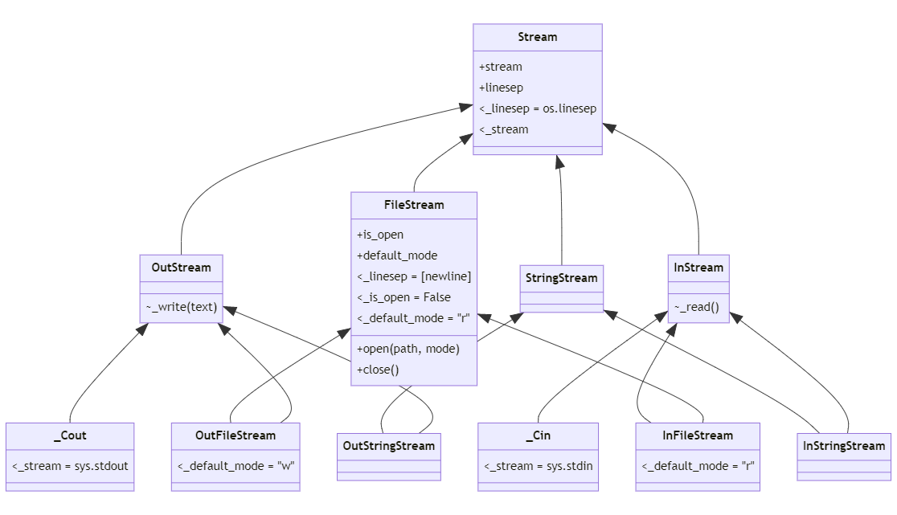

.. image:: https://img.shields.io/badge/%20imports-isort-%231674b1?style=flat&labelColor=ef8336
    :target: https://pycqa.github.io/isort/
    :alt: isort

.. image:: https://img.shields.io/badge/code%20style-black-000000.svg
    :target: https://github.com/psf/black
    :alt: black

.. image:: https://img.shields.io/pypi/v/cppstream
    :target: https://pypi.org/project/cppstream/
    :alt: pypi version

.. image:: https://img.shields.io/pypi/dm/cppstream
    :target: https://pypi.org/project/cppstream/
    :alt: downloads/monthly

.. image:: https://static.pepy.tech/badge/cppstream
    :target: https://pypi.org/project/cppstream/
    :alt: total downloads

.. image:: https://img.shields.io/pypi/pyversions/cppstream
    :target: https://pypi.org/project/cppstream/
    :alt: python versions

.. image:: https://img.shields.io/pypi/l/cppstream
    :target: https://github.com/mrlegohead0x45/cppstream/blob/main/LICENSE
    :alt: license

.. image:: https://img.shields.io/codecov/c/github/mrlegohead0x45/cppstream
    :target: https://app.codecov.io/gh/mrlegohead0x45/cppstream
    :alt: Codecov

.. image:: https://img.shields.io/github/workflow/status/mrlegohead0x45/cppstream/Test%20with%20pytest/main?label=tests
    :target: https://github.com/mrlegohead0x45/cppstream/actions/workflows/test.yaml
    :alt: tests status

.. image:: https://img.shields.io/github/workflow/status/mrlegohead0x45/cppstream/Lint%20with%20flake8%20and%20mypy/main?label=flake8%20%26%20mypy
    :target: https://github.com/mrlegohead0x45/cppstream/actions/workflows/lint.yaml
    :alt: flake8 & mypy status

.. image:: https://img.shields.io/codefactor/grade/github/mrlegohead0x45/cppstream/main
    :target: https://www.codefactor.io/repository/github/mrlegohead0x45/cppstream
    :alt: CodeFactor Grade

cppstream
---------

This is a library that implements C++-style IO with streams in Python.
It is **not** a wrapper around the actual C++ streams, but instead provides a
higher-level interface that is more Pythonic.

For example

.. code:: cpp

    #include <iostream>
    #include <fstream>
    std::cout << "Hello, " << "World!" << std::endl;

    std::ofstream ostrm("test.txt");
    ostrm << "Hello, World!" << std::endl;

translates to

.. code:: python

    import cppstream

    cppstream.cout << "Hello, " << "World!" << cppstream.endl

    ostrm = cppstream.OutFileStream()

    # or using the context manager 
    with cppstream.OutFileStream() as ofs:
        ofs.open("test.txt")
        ofs << "beans" << cppstream.endl

See the inheritance diagram:

